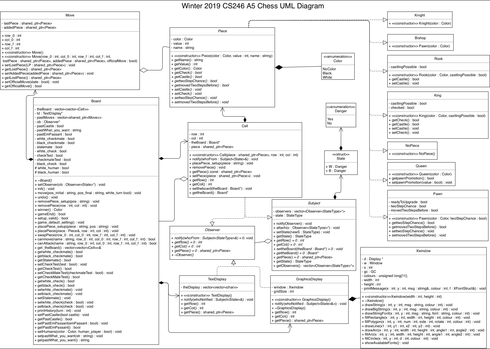

# Chess

## Summary

CS 246 - Object-Oriented Software Development
Chess Game

Team Members : Edward Jiwook Kim, Nipun Lamba, and Prabhapaar Singh Batra

Our team developed this chess game for CS246 — Assignment 5, Group Project (Winter 2019)

The chess game provides all functionalities from the assignment specification:

- 4 levels of difficulty for the computer AI
- Graphical interface using X11
- Setup Mode
- Move History
- Play Modes of
  - Player vs Player
  - Player vs Computer
  - Computer vs Computer

## Command Interpreter Instructions

- <i>game white-player black-player</i> starts a new game.
  - <i>white-player</i> & <i>white-player</i> parameters can be either <i>human</i> or <i>computer[1-4]</i>
- <i>resign</i> concedes the game to your opponent
- capital letters represent white pieces, otherwise black pieces

  | Letter | K    | Q     | R    | B      | N      | P    |
  | ------ | ---- | ----- | ---- | ------ | ------ | ---- |
  | Piece  | King | Queen | Rook | Bishop | Knight | Pawn |

   

- To move: <i>move src dst</i> (ex. <i>move e2 e4</i>)

- castling is specified by two-square move for the king

  - black: <i>move e1 g1</i>
  - white: move e1 c1

- Pawn promotion additionally specify the piece type to which the pawn is promoted: move e7 e8 Q.

- <i>setup</i> enters setup mode that can set up initial board configurations(can only be done when game is not running)

  - <i>\+ piece position</i> places the piece on the position (ex. <i>+ K e1</i>), replaces if a piece already exists
  - <i>\- position </i> removes the piece from the position(ex. <i>- e1</i>), takes no action if there is nothing
  - <i>= colour</i> makes it colour’s turn to go next(ex. <i>= white</i>)
  - <i>done</i> leaves setup mode

- <i>history</i> for viewing your past moves

For more detailed instructions:
<a href="docs/chess.pdf">
Instructions
</a>

## Design & Planning

We used Observer pattern as a design recipe for the game.

For how our team tackled the project: <a href="docs/plan.pdf">Plan</a>

  
  In pdf: <a href="docs/uml.pdf">UML Class Diagram</a>

 
